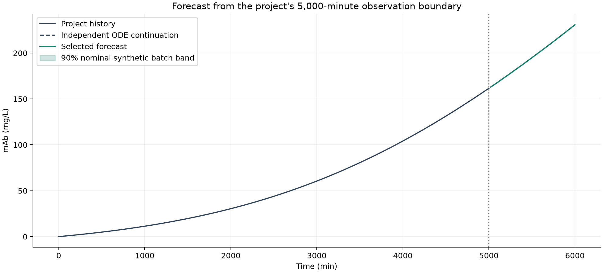

# mAb Bioreactor Forecasting

**CHO bioreactor simulation, LSTM benchmarking, and reproducible mAb forecasts.**

This project is part of the **B.Tech Project (BTP)** in the **Department of
Chemical Engineering at the Indian Institute of Technology Delhi (IIT Delhi)**.

Mechanistic simulation and time-series forecasting of monoclonal antibody (mAb)
production in a CHO cell bioreactor. This B.Tech project compares LSTM, MLP,
ridge regression, and simple forecasting baselines on 88 simulated reactor batches.

The validation-selected model is **ridge regression with a cubic correction to
an extrapolated local trend**. Trained LSTM models and all comparison results are
included. Performance is established on synthetic data; experimental validation
remains future work.

[Final report](docs/final_report.pdf) · [Report in Markdown](docs/final_report.md) ·
[Forecasting notebook](notebooks/02_mab_forecasting.ipynb) ·
[Original project brief](docs/project_proposal.pdf)



## Quick start

Run these commands from the repository root. Python 3.13 was used for the saved
results; create a virtual environment before installing dependencies.

```sh
python3 -m venv .venv
source .venv/bin/activate
python -m pip install -r requirements.txt
python predict_mab.py
```

On Windows, activate with `.venv\Scripts\activate` instead.
The command loads the included model and `data/example_batch.csv`, then writes
predictions and provenance to `results/final/project_forecast.csv` and `.json`.
No training is required. The notebook kernel should use this same environment.

## Results

| Evaluation | Selected-model RMSE (mg/L) |
| --- | ---: |
| Clean, unseen batches | 0.00521 |
| Later-time forecasts on unseen batches | 0.04855 |
| Perturbed-input sensitivity test | 6.80 |

There are 48 training, 12 validation, 12 calibration, and 16 test batches.
Each input contains 20 observations at 20-minute intervals plus known constant
operating settings. The model predicts 50 future values over 1,000 minutes.
Model selection uses validation batches; calibration and test batches are separate.
The noise scenario adds Gaussian noise with SD equal to 0.5% of each observed
feature's training SD. Its much larger error limits claims about practical use.

See the [experiment inventory](results/final/README.md) for checkpoints,
predictions, split assignments, calibration results, and figures.

## Use and reproduce

```sh
# Regenerate the supplied 5,000-minute simulation
python bioreactor.py

# Forecast a shorter horizon using explicit operating settings
python predict_mab.py --history data/example_batch.csv \
  --operation configs/operation.example.json --minutes 240 \
  --output results/custom_forecast.csv

# Rebuild the final figures and report from saved artifacts
python run_project.py --report-only

# Regenerate batches, train candidates, evaluate, and rebuild the report
python run_project.py

# Run the scientific and forecasting regression checks
python -m unittest discover -s tests -v

# Reproduce the historical single-trajectory LSTM baseline
python -m baselines.univariate_lstm
```

Full training replaces `results/final/`; use `--output-dir results/my_experiment`
to keep a separate run. `requirements-lock.txt` records the tested macOS/Python
3.13 environment; `requirements.txt` provides the direct dependency constraints.

The [simulation notebook](notebooks/01_bioreactor_simulation.ipynb) explains the
balances and generates plots. The [forecasting notebook](notebooks/02_mab_forecasting.ipynb)
loads saved results and demonstrates ridge and LSTM inference without retraining.
Both locate the project root automatically when opened within the repository.
See [advanced usage](docs/usage.md) for forecasting other state variables.

## Repository layout

The three root Python scripts are command-line entry points; reusable code lives
in `forecasting/`, and exploratory walkthroughs live in `notebooks/`.

```text
├── bioreactor.py                 # Mechanistic simulator and CSV export
├── predict_mab.py                # Saved-model forecasting CLI
├── run_project.py                # Training, evaluation, and report CLI
├── forecasting/                 # Data, models, inference, and reporting
├── baselines/                   # Historical univariate LSTM implementation
├── configs/                     # Example operating settings
├── data/                        # Example synthetic batch and schema notes
├── docs/                        # Final report, project brief, and references
├── notebooks/                   # Simulation and forecasting walkthroughs
├── results/
│   ├── final/                   # Authoritative benchmark and trained models
│   └── simulation/              # Simulation figures
└── tests/                       # Numerical and forecasting regression checks
```

## Scientific scope

The simulator follows Kumar et al. (2022), with documented transcription
corrections and an unresolved parameter-provenance discrepancy. All batches use
fixed kinetics and constant operating settings. The workflow does not establish
experimental accuracy, process control, or improved product yield or quality.
Calibration coverage is empirical for the synthetic benchmark; it does not
establish coverage under measurement noise or for each operating mode.

The historical univariate LSTM uses a different task and sampling cadence, so
its scores should not be directly compared with the final benchmark. Its source
and tests are retained; obsolete generated outputs are excluded. Running its
command regenerates those outputs under the ignored `results/baselines/` folder.

Read the [model review](docs/model_review.md),
[alignment with the project brief](docs/report_alignment.md), and
[source references](docs/references.md) for assumptions and provenance.

## Development

See [CONTRIBUTING.md](CONTRIBUTING.md) for environment setup, validation commands,
and conventions for keeping experiment results reproducible. GitHub Actions runs
the regression suite and saved-model inference on pushes and pull requests.
