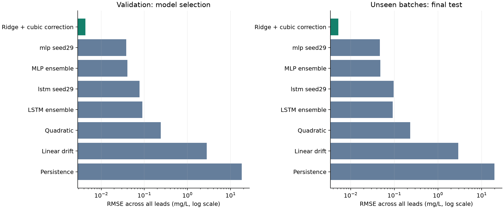
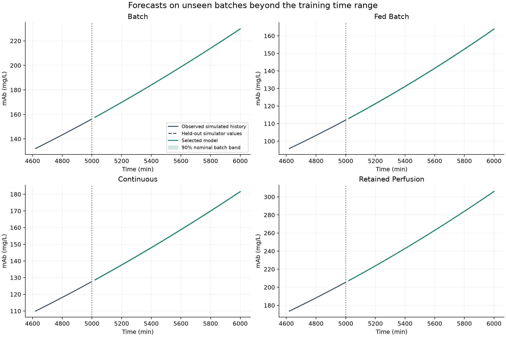
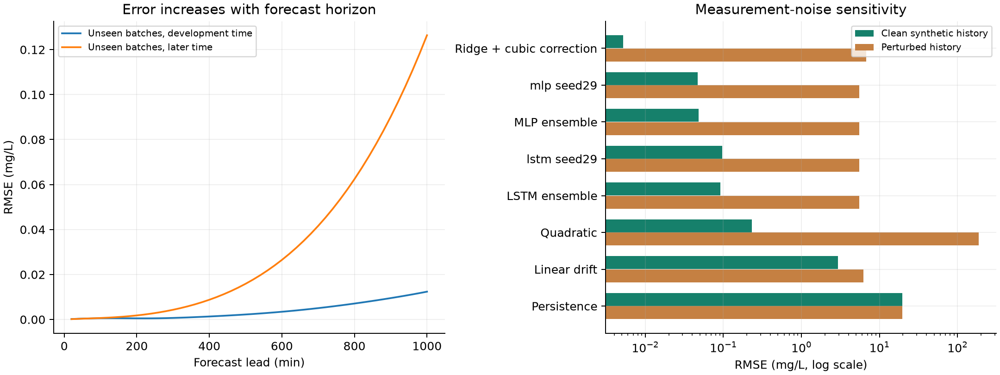

# Final project report

## Data-driven forecasting of mAb production

Simulation-based comparison of LSTM, MLP, and regularized direct forecasting

## Objective and completed scope

This project implements the B.Tech report's simulation-to-forecasting workflow for monoclonal antibody production. The completed computational deliverables are a corrected bioreactor simulator, synthetic multi-batch data generation, LSTM and alternative models, model selection, independent calibration and testing, saved inference, plots, a notebook, and this report. The result is a validated synthetic forecasting study, not a validated industrial monitoring system.

The best tested model for the declared clean synthetic task is ridge: ridge regression with a cubic correction to the extrapolated local trend. Selection uses validation data only. This is a task-specific empirical choice, not a claim that ridge regression is universally better than LSTM or modern foundation models.

## Mechanistic model and data provenance

The source is Kumar et al., Chemical Engineering and Processing 180 (2022), 108720, DOI 10.1016/j.cep.2021.108720. The simulator integrates volume, viable cells, mAb, glucose, lactate, and dead cells, deriving viability for reporting. The lactate equation uses the signed glucose rate and the printed grouping. Lacmax1 follows the reported 628 g/L; the original notebook used 6283.06289, whose fitting provenance remains unresolved.

All 88 batches are numerical solutions with fixed kinetic parameters. Initial volume spans 4800-6500 mL, viable cells 0.45-0.85 million/mL, viability 97-100%, mAb 0-8 mg/L, glucose 6-9 g/L, and lactate 0.06-0.30 g/L. Temperature varies within 308-310 K, active flow within 0.25-1.5 mL/min, and feed glucose within 12-24 g/L. Four balanced modes are represented: batch, fed-batch, well-mixed continuous, and perfusion retaining cells and mAb. Controls stay constant during a run. There were 0 rejected simulation attempts. The dataset seed is 20260916; all conditions and data hashes are saved in the manifest.

## Forecast task and leakage controls

Input: 20 observations of six reactor states and five operating settings, sampled every 20 minutes. Twenty observations span 380 minutes; future targets are the next 50 mAb values, covering 20-1000 minutes. No future glucose, cell counts, mAb, or other reactor states are supplied to the model. The supplied operating settings are assumed to remain constant.

Whole batches are assigned to training (48), validation (12), calibration (12), and final testing (16). Training and validation targets stop at 5000 minutes; development forecast origins run from 400 to 4000 minutes every 100 minutes. Each training batch contributes 37 windows, for 1776 training windows. No window crosses a batch boundary. Scaling is fitted on training histories only. Calibration is excluded from fitting and selection. Model selection is written to selection.json before test windows are constructed. A second test forecasts 5000-6000 minutes on the same unseen test batches, beyond every training target.

## Models and training

Persistence, linear drift, and local quadratic continuation are baselines. The learned models start from the last mAb value and last observed slope. They predict a smooth correction over the entire horizon: P_hat(h) = P_last + h*delta_P_last + r*(c1*u + c2*u^2 + c3*u^3), where h is the lead in samples, u=h/50, and r is a residual scale fitted on training data. The learned coefficients use only past measurements. This anchoring avoids relearning absolute concentration levels and avoids recursive feedback of predicted future inputs.

Ridge regression uses 33 features: the normalized current state/settings, the change across the history, and a midpoint curvature contrast. An intercept gives 34 regressors for three coefficients. Alpha is selected from 1e-6, 1e-4, 0.01, 1, and 100 using validation forecast RMSE. MLP uses the same feature summaries and two 64-unit SiLU layers. LSTM uses two 64-unit layers with 0.1 inter-layer dropout, plus a current-state skip connection and a small output head. Neural models use AdamW, learning rate 0.003, weight decay 1e-5, gradient clipping, validation-based scheduling, and early stopping. Three seeds (11, 29, 47) and their prediction ensembles are evaluated for each network. The original report's univariate two-layer LSTM remains available as a historical baseline in baselines/univariate_lstm.py; its old scores use a different task and must not be directly compared to this benchmark.

## Results and interpretation

The selected model's validation RMSE is 0.00432817 mg/L. On 16 unseen batches, its pooled test RMSE is 0.00521468 mg/L and MAE is 0.00301862 mg/L. This reduces error by 99.822% relative to the linear-drift baseline for this clean synthetic task. The best validation-selected LSTM candidate is lstm_seed29, with test RMSE 0.0967242 mg/L.

On the later 5000-6000-minute test, the selected model's RMSE is 0.0485464 mg/L. The test RMSE at the 1000-minute lead is 0.0123759 mg/L. The very small errors reflect a deterministic, smooth simulator with fixed kinetics and exact observations. They do not imply equal accuracy on laboratory data. Repeated windows in one batch are dependent; uncertainty in average batch performance is bootstrapped by batch, not by individual overlapping rows.

All table entries are RMSE in mg/L; later-time test uses unseen batches at 5000-6000 minutes.

| Model | Validation RMSE | Test RMSE | Later-time test RMSE |
| --- | ---: | ---: | ---: |
| Ridge + cubic correction | 0.00432817 | 0.00521468 | 0.0485464 |
| mlp_seed29 | 0.0383076 | 0.0469074 | 0.121366 |
| MLP ensemble | 0.0405997 | 0.0481772 | 0.101811 |
| lstm_seed29 | 0.077452 | 0.0967242 | 0.560357 |
| LSTM ensemble | 0.0901132 | 0.0915238 | 0.638449 |
| Quadratic | 0.24144 | 0.230674 | 0.162119 |
| Linear drift | 2.81533 | 2.92435 | 4.09326 |
| Persistence | 18.1188 | 19.6768 | 43.0714 |

## Uncertainty and sensitivity

A separate set of 12 calibration batches supplies one maximum absolute error score per batch, spanning all origins and forecast leads, including the later interval. The finite-sample 90% conformal rank gives a constant radius of 0.316788 mg/L. On the 16 clean synthetic test batches, observed simultaneous coverage is 100.0%; point coverage is 100.0%. With only 12 calibration batches, the nominal 90% rule selects the largest calibration score and is conservative. This is a synthetic-distribution statement, not a clinical or experimental confidence claim.

The predeclared sensitivity test adds independent Gaussian perturbations with SD equal to 0.5% of each state's training standard deviation, leaving controls unchanged. The selected model's RMSE rises to 6.79964 mg/L. These perturbations are an illustrative stress test, not a measured sensor-noise distribution. Trend and curvature estimates amplify measurement errors. The supplied model and clean-data intervals should therefore not be represented as robust to noisy laboratory inputs. No model is retrained or selected using these test perturbations. The usual distribution-free conformal guarantee requires exchangeable calibration and future batches. This benchmark balances operating modes by design; pooled exchangeability across modes has not been established. Interpret the bands as nominal, empirically checked calibration, not a proven guarantee for each mode.

## Project forecast and use

For the original project's 5000-minute history, the saved model forecasts the next 1000 minutes without solving the ODE. At 6000 minutes it predicts 230.909 mg/L. A separately generated reference continuation gives 230.611 mg/L; forecast RMSE on this illustrative path is 0.115654 mg/L. The reference is computed after selection and is not passed to inference.

Run: python predict_mab.py --history data/example_batch.csv --operation configs/operation.example.json. The command loads best_model.pt and saves concentrations, interval bounds, and provenance metadata. It requires the original seven CSV columns, at least 20 compatible history timestamps, and the correct known constant controls. It does not interpolate missing timestamps or extrapolate beyond the trained 1000-minute horizon. It flags features substantially outside the empirical training range. For a shorter horizon use --minutes 240. To forecast from an earlier observed timestamp use --origin 4000; later CSV rows are ignored.

## Reproduction, limitations, and next scientific step

Install requirements.txt in a Python virtual environment. Run python run_project.py to regenerate all 88 batches, train candidates, select, calibrate, evaluate, forecast, and rebuild this report. Run python run_project.py --report-only to regenerate plots and the report from saved artifacts without retraining. Run python -m unittest discover -s tests -v for the regression and scientific-validity checks. requirements-lock.txt records the tested environment.

The completed deliverable is the reproducible computational B.Tech project. Independent experimental validation remains outside the available data. Before deployment, obtain measured runs, resolve the original kinetic fit and parameter discrepancy, model observation noise, recalibrate intervals, and evaluate whole held-out experimental batches. The present system assumes fixed kinetics, constant feed/temperature settings, and the declared operation modes. It does not model pH, implement plant control, optimize yield, or demonstrate antibody quality. Its strongest result is that a compact learned model can accurately emulate this simulator's forecast trajectories; a more complicated model is not automatically the best choice.

## References

- project_proposal.pdf, supplied project brief, pages 3-11.
- Kumar et al. (2022), Multi-objective optimization of monoclonal antibody production in bioreactor. https://doi.org/10.1016/j.cep.2021.108720
- Hochreiter and Schmidhuber (1997), Long Short-Term Memory. Neural Computation 9(8), 1735-1780.
- Zeng et al., Are Transformers Effective for Time Series Forecasting? https://arxiv.org/abs/2205.13504. Motivation for testing simple models; the project does not claim to implement DLinear.
- Chen et al., TSMixer: An All-MLP Architecture for Time Series Forecasting. https://arxiv.org/abs/2303.06053. Motivation for a feed-forward comparison; the project MLP is not TSMixer.
